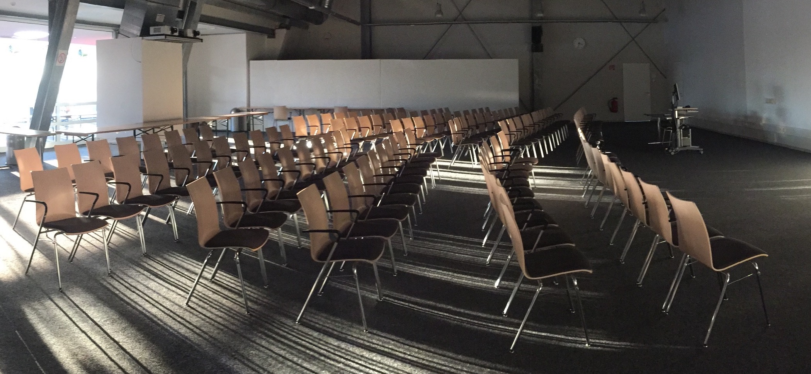

# Satellite workshop on Data Analysis and Karabo 

* Tuesday 23 January 2018, 10:00-17:00 at DESY, [FLASH Seminar room (building 28c)](https://www.google.de/maps/place/FLASH/@53.5804765,9.8796105,1213m/data=!3m2!1e3!4b1!4m5!3m4!1s0x47b1842e70501fed:0x8cc3df31f98c81f7!8m2!3d53.5804733!4d9.8818045)

* The event is part of
the
[2018 XFEL user meeting](https://indico.desy.de/indico/event/18831/)

* The data analysis workshop is split into two parts, which can be
  attended independently (or both together):

## Morning session: Introduction to Jupyter Notebook (10:00-13:00)

The morning session offers a hands-on workshop introducing
the [Jupyter Notebook](http://jupyter.org) for which we invite
participants to bring laptops. This is suitable for those with some
programming experience, and assumes no prior knowledge of the Jupyter
Notebook. See [here for details](jupyter.md).

### Lunch (13:00 - 14:00)

Everybody is invited for lunch and networking from 13:00 to 14:00.

## Afternoon session: Karabo and Data Analysis at XFEL (14:00-17:00)

The afternoon session provides an overview of Karabo, experiment
control, and online and offline data analysis provision at European
XFEL.

### Agenda (afternoon)

* 14:00 Welcome (S Brockhauser)
* 14:05 Overview to data analysis infrastructure (H Fangohr)
* 14:15 Introduction to Karabo (G Flucke)
* 14:30 Detectors and Calibration (S Hauf)
* 15:15 Break
* 15:45 Offline and Online Data analysis at XFEL (T Michelat)
* 16:30 Discussion (S Brockhauser)
* 17:00 Close

